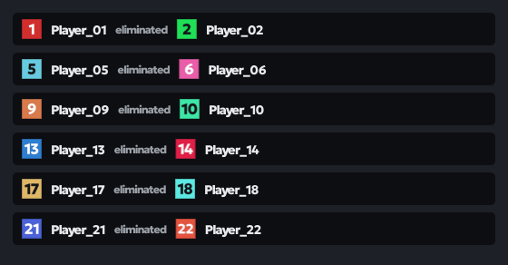
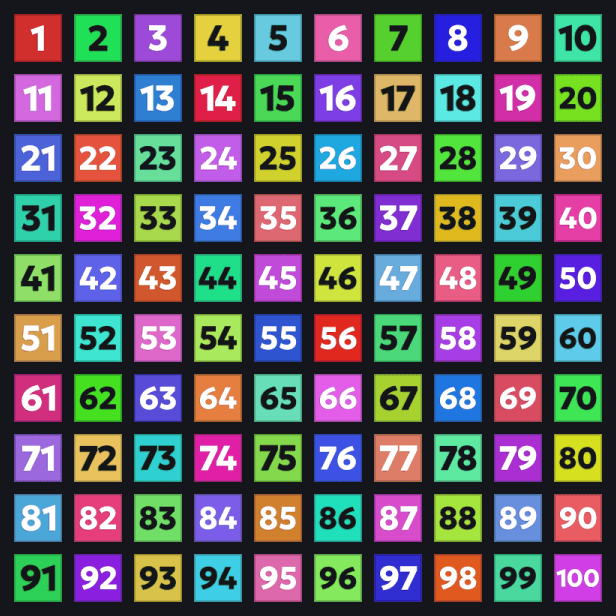
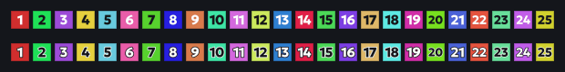

# PUBG Numbers Feed

100 numbered killfeed team icons for **PUBG: BATTLEGROUNDS** — big, high-contrast team digits in distinct colors, readable on any background at any killfeed size.



## Why numbers

Flags require memorizing 100 flag-to-team mappings. Numbers don't: the team digit is the icon. Each team gets its own color so entries can be told apart at a glance, while the digit itself stays the primary identifier.

## Features

- **100 icons** (`001.png`–`100.png`) covering squads, duos and solos
- **Geologica ExtraBold (800)** digits, auto-fitted per digit count so 1-, 2- and 3-digit numbers all fill the icon
- **Distinct color per team** — hues stepped by the golden angle (137.5°), so neighboring team numbers never share a hue
- **WCAG auto-contrast** — digit color (white / near-black) picked per background via relative luminance
- **Two variants**
  - `TeamIcon` — flat: digit on color with a subtle frame
  - `TeamIconNumbered` — outlined: digit gets a high-contrast outline for extra punch on busy backgrounds
- **Lightweight** — palette-quantized PNGs, ~0.5 KB per icon
- **Observer-ready** — `Teaminfo.csv` and folder layout match what the game expects






## Install (into the game)

1. Get the repo (clone, or download a [release](../../releases) zip and unzip it)
2. Open Windows Explorer and paste into the address bar:
   ```
   %LOCALAPPDATA%\TslGame\Saved
   ```
3. Copy the `Observer` folder there. It should contain `TeamIcon`, `TeamIconNumbered` and `Teaminfo.csv`
4. **Optional:** prefer the outlined variant? Rename `TeamIconNumbered` to `TeamIcon` (rename the other one to anything else)
5. Play

## Build from source

```bash
npm install
npm run generate
```

Outputs:

- `Observer/` — icons + `Teaminfo.csv` (paste this into the game)
- `preview/` — contact sheets and demo images
- `dist/pubg-numbers-feed-v1.0.0.zip` — ready-to-share archive with the `Observer` folder

Tweak `COUNT`, `SIZE` or the palette in `teamColor()` inside `src/generate.js` and re-run.

## Typography

[Geologica](https://fonts.google.com/specimen/Geologica) by Nyisha Mirza Kalimar, Nazareth Seferian & Eben Sorkin — ExtraBold (weight 800), auto-sized up to 48 px on the 64 px canvas. The font is bundled in `src/assets/fonts/` under the [SIL Open Font License 1.1](src/assets/fonts/Geologica-OFL.txt).

## Credits

- Install flow and `Observer` layout follow [nitnat/pubg-flagfeed](https://github.com/nitnat/pubg-flagfeed), the project that inspired this one
- Original custom killfeed icon idea: [Kowo](https://youtu.be/8OWbQ_wXhpk)

## License

- Code and generated icons: [MIT](LICENSE)
- Bundled font (`src/assets/fonts/`): SIL OFL 1.1
